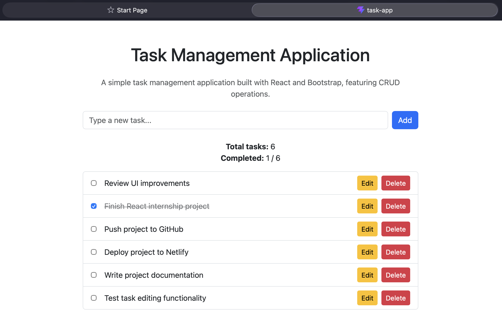

# Task Management Application

Live Demo: [View the App](https://task-management-app-altugyamak.netlify.app)

A simple task management web application built with **React** and **Bootstrap**.

This project was developed during my **Software Development Internship at Software Persona**.
The goal of the project was to practice modern frontend development and implement basic **CRUD (Create, Read, Update, Delete)** functionality using React.

---

## Features

* Add new tasks
* Edit existing tasks
* Delete tasks
* Mark tasks as completed
* Display total number of tasks
* Responsive user interface

---

## Technologies Used

* React
* JavaScript (ES6)
* Bootstrap
* Vite

---

## Screenshot



---

## Project Structure

```
src
 ├ Components
 │   ├ TaskForm.jsx
 │   └ TaskList.jsx
 ├ Pages
 │   └ Home.jsx
 └ Interfaces
     └ task.js
```

---

## Running the Project

To run the project locally:

```
npm install
npm run dev
```

---


